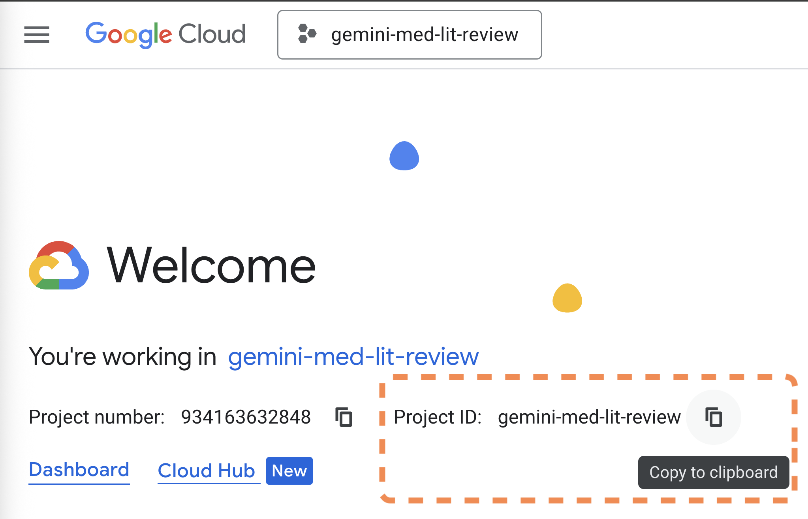
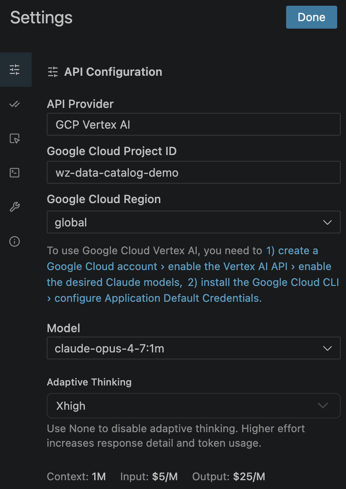
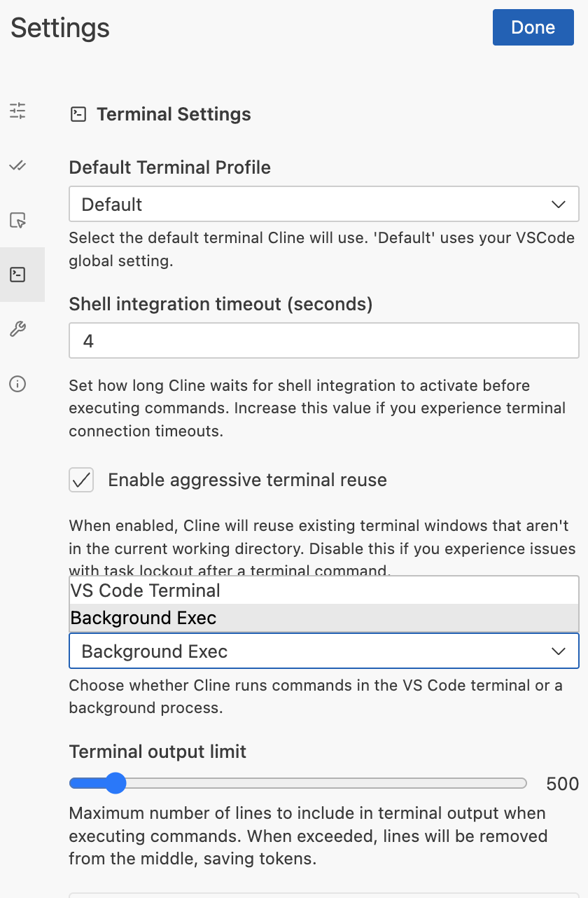

<!--
Copyright 2026 Google LLC

Licensed under the Apache License, Version 2.0 (the "License");
you may not use this file except in compliance with the License.
You may obtain a copy of the License at

    https://www.apache.org/licenses/LICENSE-2.0

Unless required by applicable law or agreed to in writing, software
distributed under the License is distributed on an "AS IS" BASIS,
WITHOUT WARRANTIES OR CONDITIONS OF ANY KIND, either express or implied.
See the License for the specific language governing permissions and
limitations under the License.
-->

# Agentic Coders Setup

## ▶ [Slides](https://wandlzhang.github.io/GPS-AI-Infra-Onboarding-Workshop/slides.html)

---

By the end of this guide, you will have agentic coding assistance who have ready access to Google Cloud documentation via [Developer API MCP](https://developers.google.com/knowledge/mcp), [Google Cloud Logging MCP](https://docs.cloud.google.com/logging/docs/reference/v2_mcp/mcp), Github MCP, and HuggingFace MCP.

### 1. Choose IDE

- **[Visual Studio Code](https://code.visualstudio.com/)** (local machine)
- **[Google Cloud Workstation](https://cloud.google.com/workstations/docs/create-workstation)** (browser-based, includes Code OSS)

### 2. Install gcloud CLI

```bash
# Follow https://cloud.google.com/sdk/docs/install
# Then authenticate:
gcloud auth login
gcloud auth application-default login
```

### 3. Set up a Google Cloud Project

1. Create a New Project in [console.cloud.google.com](https://console.cloud.google.com/projectcreate). To manage your billing go to [console.cloud.google.com/billing](https://console.cloud.google.com/billing)
2. On the Project main page, you'll see a `Project ID` you can copy:



3. To use Claude APIs, navigate to [Model Garden](https://console.cloud.google.com/vertex-ai/publishers/anthropic/model-garden/claude-opus-4-8) (and enable Vertex AI APIs if it pops up). Look to Anthropic to choose a model like Opus 4.8, and fill out a nominal form to turn on the API. 

### 4. Install Cline

Inside VS Code / Code OSS:

1. Open Extensions (`Ctrl+Shift+X` / `Cmd+Shift+X`)
2. Search for **`Cline`** (publisher: `saoudrizwan`)
3. Install it
4. Click "I have my own API key"
5. Inside the gear settings, Set up your Cline like this with your own `Project ID`:



6. In Terminal settings, Background Exec is typically a good choice:



### 5. Generate a HuggingFace Token (optional)

The HuggingFace MCP gives your AI assistant access to models, datasets, papers, and Spaces.

1. Go to [huggingface.co/settings/tokens](https://huggingface.co/settings/tokens)
2. Click **Create new token**
3. Give it a name (e.g. `cline-mcp`) and select **Read** access
4. Copy the token — you'll paste it in the next step

### 6. Ask Cline to set up its own MCP servers

Have this repo open in your IDE. Start a new task in Cline and paste:

> Set up MCP servers using the template in `01-foundational-tools/agentic-coder-setup/cline/cline_mcp_settings.template.json`. Install each server per its `_install` instructions, copy the proxy scripts from `mcp-servers/`, and generate the final `cline_mcp_settings.json`. My HuggingFace token is `<HF_TOKEN>`.

Cline will read the config files in [`cline/`](./cline/) and wire everything up.

> **Mac / Apple Silicon note:** the `github-mcp-server` binary is published as **Linux x86_64-only**. On Mac (Intel or Apple Silicon) that MCP install will fail. Either skip github-mcp on Mac, or run the workshop from a Cloud Workstation.

### 7. Ask Cline to install Claude Code or Gemini CLI

Open a new Cline task and paste:

> Install Claude Code CLI and set it up using the config in `01-foundational-tools/agentic-coder-setup/cli-agent/`. Set up the Vertex AI backend, MCP servers, system prompt, and launcher script.

Or for Gemini CLI:

> Install Gemini CLI and set it up using the config in `01-foundational-tools/agentic-coder-setup/cli-agent/`. Configure the MCP servers and system instructions.

Cline will read the config files in [`cli-agent/`](./cli-agent/) and handle the installation.

> **Model versions:** Both Cline-on-Vertex (step 3) and the Claude Code CLI installed here use **Claude Opus 4.8** via the Vertex AI backend.

---

## What's in this folder

```
agentic-coder-setup/
├── README.md                              # This file
├── cline/                                 # Cline (IDE) config
│   ├── cline_mcp_settings.template.json   # MCP settings template (all 5 servers)
│   ├── mcp-servers/
│   │   ├── google-cloud-logging/proxy.mjs # stdio proxy for Cloud Logging API
│   │   └── google-dev-knowledge/proxy.mjs # stdio proxy for Google Dev docs
│   └── rules/
│       ├── development.md                 # SDLC & quality standards
│       └── coding_preferences.md          # Example coding preferences
└── cli-agent/                             # Claude Code & Gemini CLI config
    ├── README.md                          # Detailed setup for both CLIs
    ├── claude-code/
    │   ├── bin/claude-start               # Launcher (Vertex AI, max context)
    │   ├── CLAUDE.md                      # Global system prompt
    │   └── settings.json                  # Permissions config
    ├── gemini-cli/
    │   └── GEMINI.md                      # System instructions
    └── shared/
        └── google-cloud-logging/proxy.mjs # stdio proxy (shared by both CLIs)
```
